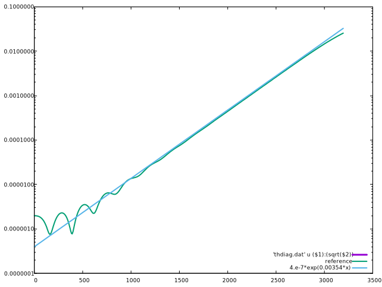

[](https://www.youtube.com/watch?v=mxnaGG1dfsk)

Video made with [VisIt](https://visit-dav.github.io/visit-website/releases/)

```
num_cells_x1 = 128
num_cells_x2 = 128
num_cells_x3 = 128
num_cells_x4 = 128
```

and

```
number_iterations = 1000
```


## Installation

### Download
```bash
git clone https://github.com/selalib/bsl_dk_3d1v_polar
cd bsl_dk_3d1v_polar
```

### Dependencies

   - Fortran compiler
   - openmpi
   - hdf5 built with mpi
   - fftw
   - cmake

### selalib

   - http://selalib.github.io
   
   ```bash
   make sllbuild SLL_DIR=/opt/selalib
   ```
   
## Build

```
make SLL_DIR=/opt/selalib
```

## Directory structure

  - bsl_dk_3d1v_polar         : executable
  - dksim4d_polar_input.nml   : input file
  - dksim4d_polar.gnu         : gnuplot script
  - dksim4d_polar_ref.dat     : reference results
  - README.md                 : info (this file)

## HOWTO

  1. Run parallel simulation within directory
  ~~~
       $ mpirun -np 4 ./bsl_dk_3d1v_polar ./dksim4d_polar_input.nml
  ~~~
  
  2. Run included gnuplot script
  ~~~
       $ gnuplot --persist dksim4d_polar.gnu
  ~~~


  
  3. Run gnuplot scripts generated at runtime
  ~~~
       $ gnuplot --persist rho_0.gnu
  ~~~
  
